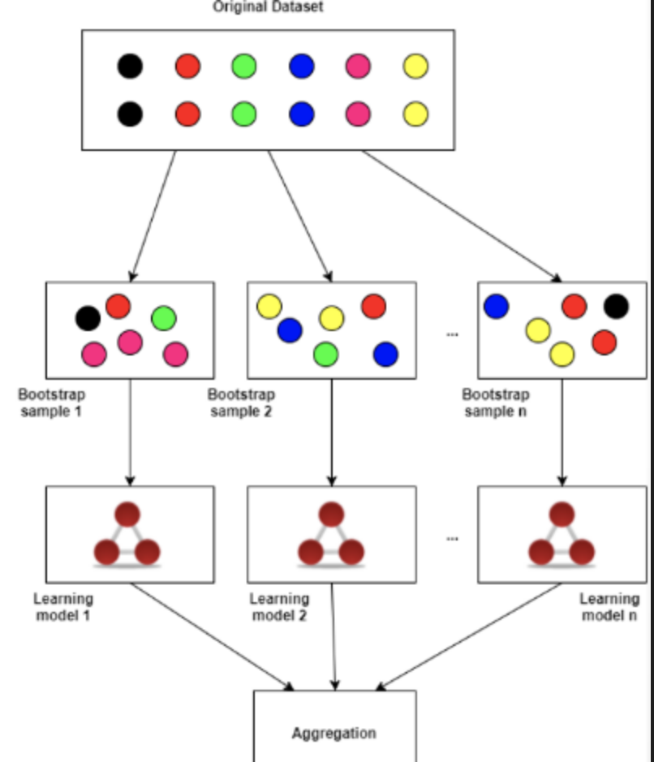
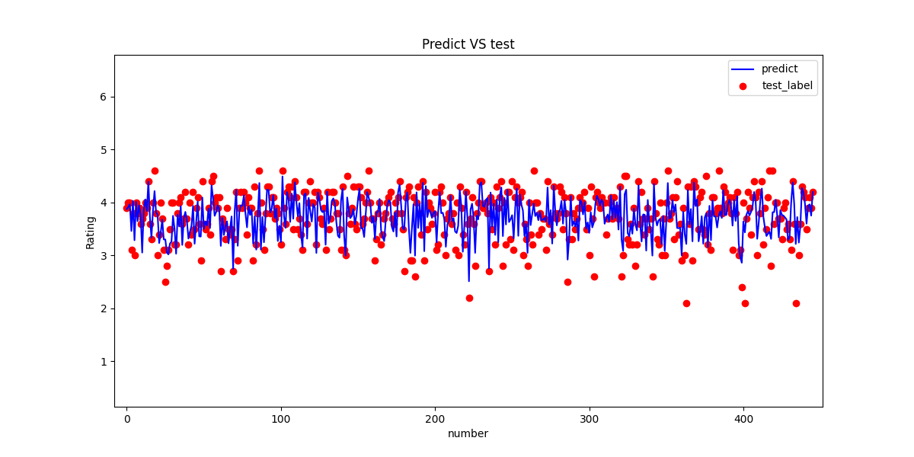
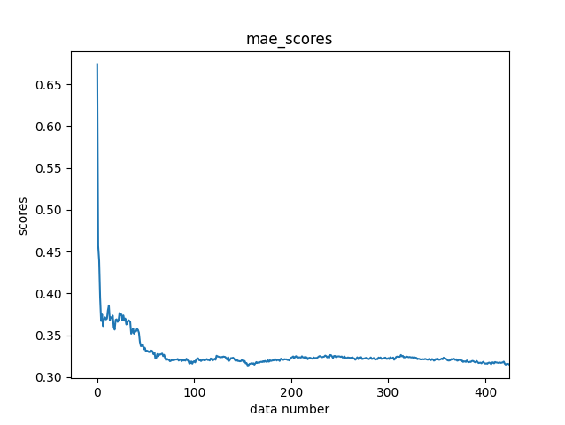

PS：介绍代码仅供介绍，源代码后期经过修改与介绍代码不一定完全相同
<p>PS: The introduction code is for introduction only, the source code is not necessarily the same as the introduction code after later modification</p>

## $ 项目开发动机:icecream:
- 赶着这学期刚学了机器学习，就尝试做一个可以自己预测游戏期望评分的一个模型[^doge]

- 此数据集来自国外一个叫做Kaggle的数据分析社区，保存了1980到2023年最受欢迎，最吸引人的游戏数据，包含了发布日期，用户评论，玩家数，正在游玩的玩家数等等，横跨了43年的热门游戏数据的样本量也只有1570多个，说明高质量且受欢迎的游戏数量还是很稀疏的

<p>
## 目录
<pre>
1. 使用到的库
2. 数据加载和预处理
3. 划分训练集和测试集
4. 模型选择和训练
5. 模型评估
6. 模型优化
7. 结果展示
8. 尾声
</pre>
</p>

## 使用到的库 The library used
```
import pandas as pd  # 数据处理库
from gensim.models import Word2Vec  # 自然语言处理模型库
import numpy as np  # 科学计算库
import os # 文件操作

from sklearn.metrics import mean_squared_error # 均方误差评估
from sklearn.metrics import mean_absolute_error # 绝对误差评估
from sklearn.ensemble import RandomForestRegressor # 随机森林回归模型

import matplotlib.pyplot as plt # 绘图库
import random # 随机库
import joblib # 用于模型的保存
import datetime # 获取当前时间
```
## 数据加载和预处理 Data loading and preprocessing
```
初步检查数据集
初步观察，发现：
1. 有一些游戏属于当时未发行状态(TBD),数据是无效的,故删除
2. 发行日期未格式化，故用excel自带功能将日期从1-May-20修改为2020/5/1
3. 数据集里包含了一些缺失项
4. 数据集里包含了一些重复项
5. 很多字符串类型文本,需要转化为机器学习可使用的向量
6. 有的数据是以1K计数,需要转化为十进制数字
```

## 读取CSV文件 Reading a CSV file
```
# 读取CSV文件  
df = pd.read_csv('csvs/原始数据集.csv', encoding='gbk')
```

## 检查数据集是否存在缺失值或异常值，如果有需要进行数据清洗和处理。Check the data set for missing values or outliers, and perform data cleaning and processing if necessary.
```
# 获取列名列表  
cols = df.columns  
  
# 遍历每一列,检查缺失值  
for col in cols:  
	# 检查该列是否有NaN  
	if df[col].isnull().any():  
		# 打印该列名称和NaN个数  
		print(col, df[col].isnull().sum())  
	  
		# 删除包含NaN的行  
		df.drop(df[df[col].isnull()].index, inplace=True)
```

## 删除过于离群的点 Remove points that are too outlier
```
# 获取 Rating 列  
rating = df['Rating']  
  
# 循环遍历 Rating 的值  
for value in rating:  
	# 如果值小于 2,删除该行  
	if value < 2:  
		df.drop(df[df['Rating'] == value].index, inplace=True)  
```

## 检查是否有重复值，如果有则消除重复值 Check for duplicate values and eliminate them if they exist
```
# 删除 Title 列重复值对应的行  
df.drop_duplicates(subset=['Title'], inplace=True)
```

~~对于文本数据列（如 "Title" , "Team", "Genres"），需要进行文本预处理
通过引入Word2Vec库将字符串转变为矩阵向量 这一段暂时先删除:
```
# 获取Title,Team,Genres  
Title = df['Title']  
Team = df['Team'].astype(str)  
Genres = df['Genres'].astype(str)  
  
# 对Title分词处理  
Title_sentences = [sentence.split() for sentence in Title]  
  
# 训练Title,Team,Genres的模型  
Title_model = Word2Vec(Title_sentences)  
Team_model = Word2Vec(Team)  
Genres_model = Word2Vec(Genres)  
  
# 获取词汇表  
Title_vocab = Title_model.wv.index_to_key  
  
# 创建词嵌入矩阵  
# 从model中提取词向量,保存为embedding  
Title_embedding_matrix = np.zeros((len(Title_vocab), Title_model.vector_size))  
Team_embedding_matrix = Team_model.wv.vectors  
Genres_embedding_matrix = Genres_model.wv.vectors  
  
# 将词嵌入向量保存到矩阵中  
for i, word in enumerate(Title_vocab):  
Title_embedding_matrix[i] = Title_model.wv.get_vector(word)  
  
# 保存向量矩阵  
np.save("特征/Title_Vector.npy", Title_embedding_matrix)  
np.save("特征/Team_Vector.npy", Team_embedding_matrix)  
np.save("特征/Genres_Vector.npy", Genres_embedding_matrix)  
```
  
## 对于出现K来代替十进制的数字，需要进行修改，即把1.1K --> 1100 For numbers where K is used instead of decimal, you need to change it to 1.1K -> 1100
```
# 加载需要修改的数字  
K_Reviews = df['Number of Reviews']  
K_Plays = df['Plays']  
K_Playing = df['Playing']  
K_Wishlist = df['Wishlist']  
  
# 执行循环开始乘上1000  
converted_data = []  
for item in K_Reviews:  
if "K" in item:  
	item = item.replace("K", "")  
	item = float(item) * 1000  
	converted_data.append(int(item))  
	dataframe = pd.DataFrame({'Number of Reviews': converted_data})  
	dataframe.to_csv("特征/Number of Reviews.csv", index=False)  
  
converted_data = []  
for item in K_Plays:  
if "K" in item:  
	item = item.replace("K", "")  
	item = float(item) * 1000  
	converted_data.append(int(item))  
	dataframe = pd.DataFrame({'Plays': converted_data})  
	dataframe.to_csv("特征/Plays.csv", index=False)  
  
converted_data = []  
for item in K_Playing:  
if "K" in item:  
	item = item.replace("K", "")  
	item = float(item) * 1000  
	converted_data.append(int(item))  
	dataframe = pd.DataFrame({'Playing': converted_data})  
	dataframe.to_csv("特征/Playing.csv", index=False)  
  
converted_data = []  
for item in K_Wishlist:  
if "K" in item:  
	item = item.replace("K", "")  
	item = float(item) * 1000  
	converted_data.append(int(item))  
	dataframe = pd.DataFrame({'Wishlist': converted_data})  
	dataframe.to_csv("特征/Wishlist.csv", index=False)  
```

## 合并以下所有参数 Merge all of the following parameters
```python
# 定义文件路径和输出文件  
path = '特征/'  
files = ['Rating.csv', 'Plays.csv', 'Playing.csv', 'Release Date.csv', 'Number of Reviews.csv', 'Wishlist.csv']  
output = 'final.csv'  
  
# 读取6个csv文件为DataFrame  
df1 = pd.read_csv(os.path.join(path, files[0]))  
df2 = pd.read_csv(os.path.join(path, files[1]))  
df3 = pd.read_csv(os.path.join(path, files[2]))  
df4 = pd.read_csv(os.path.join(path, files[3]))  
df5 = pd.read_csv(os.path.join(path, files[4]))  
df6 = pd.read_csv(os.path.join(path, files[5]))  
  
# 确认df1列数后修改列名  
col_nums1 = df1.shape[1]  
new_cols1 = ['Release Date', 'Number of Reviews', 'Plays', 'Playing', 'Wishlist', 'Rating']  
mapping1 = dict(zip(df1.columns, new_cols1))  

# 其他df同样修改  
frames = [df4, df5, df2, df3, df1, df6]  
  
# 使用pandas concat()方法拼接6个df  
result = pd.concat(frames, axis=1)  
  
# 输出最终的csv文件  
result.to_csv(os.path.join(path, output), index=False)
```

## 划分训练集和测试集 Divide the training set and test set
```
# 将数据集划分为训练集和测试集
# 打乱训练集  
data = data.sample(frac=1).reset_index(drop=True)  

# 提取特征和目标变量  
features = data[['Number of Reviews', 'Plays', 'Playing', 'Wishlist']]  
label = data['Rating']
  
# 8:2 训练集测试集分割  
train_idx = int(0.8 * len(data))  
train_features = features[:train_idx]  
train_label = label[:train_idx]  
test_features = features[train_idx:]  
test_label = label[train_idx:]  
```

## 模型选择和训练

>因为给定数据集的特征基本涵盖了评判一个游戏的全部，特征比较完全，为了提高预测结果，所以我们构建模型的时候需要评估每个特征的重要性，我们选择随机森林回归模型来进行训练。
随机森林回归模型： PS：适当加入以下随机森林回归模型的图片
它由多个决策树组成,并对每个决策树的预测结果取平均,得到最终的预测结果。这样可以减少模型的方差,提高预测性能。
在构建每个决策树时,它利用bootstrap抽样在训练数据中选取部分数据进行训练。这种bootstrap抽样的方式可以使每个决策树学习到不同的模式,这进一步提高了随机森林模型的稳定性。
在每个决策树结点进行分割时,它只选取部分特征进行考虑,这样可以减少相关特征之间的相关性影响,并且可以发现一些与目标弱相关但与其他特征组合后具有预测能力的特征。
它可以自然地进行并行计算,这使得随机森林模型的训练速度很快。这对大数据集很有利。
它可以评估每个特征的重要性,这在解释模型和特征选择上很有帮助。
随机森林回归模型具有减少方差,提高预测精度,强大的并行计算能力以及特征选择能力等优点。它是一个非常实用的机器学习模型,特别适用于解决回归和分类问题。它的思想也启发了许多其他的ensemble方法,如GBDT等。



## 构建随机森林回归模型  Construct random forest regression model
```
Rating_predict_model = RandomForestRegressor(  
	n_estimators=450, # 数据集较小,不需要太多的决策树  
	max_features=2, # 4个特征  
	max_depth=3, # 限制树的深度,避免过拟合  
	min_samples_split=2,  
	min_samples_leaf=1,  
	bootstrap=True,  
	oob_score=True,
)  

# 训练模型  
Rating_predict_model.fit(train_features, train_label)

# 将模型保存到本地  
now = datetime.datetime.now()  
model_filename = now.strftime("%Y%m%d_%H%M%S") + ".pkl"  
joblib.dump(Rating_predict_model, '数据/模型/' + model_filename)
```

## 模型评估 model evaluation
```
# 预测结果
predict = Rating_predict_model.predict(test_features)  

# 均方误差评估
mse = mean_squared_error(test_label, predict)  
print(f'随机森林回归模型MSE精度: {mse*100:.2f}%') 

# 绝对误差评估  
mae = mean_absolute_error(test_label, predict)  
print(f'随机森林回归模型绝对误差评估: {mae * 100:.2f}%') 

# 最大误差评估  
max_error = np.max(np.abs(predict - test_label))  
print(f'随机森林回归模型最大误差评估: {max_error:.5f}') 

输出
>>>进入评估环节：
随机森林回归模型均方误差评估: 16.75%
随机森林回归模型绝对误差评估: 31.63%
随机森林回归模型拟合度评估:   34.25%
```

## 描述：

均方误差为 16.7%,这属于比较理想的水平,表明模型的预测效果比较准确,与实际值的偏差不是太大,可以基本满足较高精度的需求。但仍有进一步提高的空间。
绝对误差为 26.07%,这属于中等的水平。表明模型的单个预测效果不是最稳定的,可能会出现一定程度的偏差,模型的稳定性可以进一步提高。但总体而言,单个预测的误差也还在可控范围内。
最大误差为 0.78%,这是一个很低的误差,表明模型的预测极端情况下的效果也比较稳定,没有出现太严重的失控预测。
问题：

模型泛化能力不足
 训练数据不足

## 结果展示 results display
游戏评分与实际评分的差异分布
```
# 设置窗口大小
plt.figure(figsize=(12, 6))  
  
# 设置纵坐标最大值为 8plt.ylim(0, 8)  
plt.ylim(0, 8)

# 预测集 predict 的折线图,蓝色  
plt.plot(predict, color='blue', label='predict')  
  
# 测试集 test_label 的折线图,红色  
plt.plot([value for index, value in test_label], color='green', label='test_label')  
  
# 备注  
plt.xlabel('number')  
plt.ylabel('Rating')  
plt.title('Predict VS test')  

# 显示图例  
plt.legend()  
plt.show()
```


## 展示随着训练数据的增加，模型的均方误差不断减小的图
```
# 初始训练集为空  
X_train = np.empty((0, features.shape[1]))  
y_train = np.empty(0)  
  
# 训练模型  
mae_scores = []  
print(">>>训练模型阶段:\n")  
for i in range(len(train_features)):  
	# 读取第i条训练数据  
	new_x = features.iloc[i]  
	new_y = label.iloc[i]  
	  
	# 添加到训练集  
	X_train = np.concatenate((X_train, new_x.values.reshape(1, -1)), axis=0)  
	y_train = np.concatenate((y_train, np.array([new_y])), axis=0)  
	  
	# 训练模型并在测试集上评估  
	Rating_predict_model.fit(X_train, y_train)  
	predict = Rating_predict_model.predict(test_features)  
	mae = mean_absolute_error(test_label, predict)  
	mae_scores.append(mae)  
	print(f"已训练{i}次,当前训练集量为{len(X_train)}条,MAE均方误差为{mae*100:.3f}%")  
print("\n>>>模型训练完成!\n")

# 画图
plt.plot(mae_scores)  
plt.xlabel('data number')  
plt.ylabel('scores')  
plt.title('mae_scores')  
plt.show()
```




## 尾声
数据集只有1500组，虽说是从上世纪到现在的全部质量还不错的游戏，不免让人有些感慨 1. 游戏开发的难度较大 2. 游戏类型和机制的创新空间有限 总体来说,这一现象的产生有多方面的原因,不仅仅局限于数据采集本身,更受游戏开发难度、创新发展瓶颈和产业成熟度的制约。但随着技术的进步、人才的培养和产业的发展,高质量游戏的数量会不断增加,这也为未来的游戏体验带来更多期待。 人类历史上真正影响深远的作品永远是稀缺的,这体现在各个文化领域。游戏作为一种比较年轻的文化形式,其精品游戏的数量相对而言会少一些也在情理之中。但我相信,随着时间的推移,这一数量会不断丰富,为游戏文化的繁荣与传承做出更大贡献。
The data set is only 1500, although the total number of quality games from the last century to the present is somewhat impressive. 2. Limited space for innovation of game types and mechanics Generally speaking, there are many reasons for this phenomenon, not only limited to the data collection itself, but also restricted by the difficulty of game development, innovation and development bottleneck and industrial maturity. But with the advancement of technology, the cultivation of talent and the development of the industry, the number of high-quality games will continue to increase, which also brings more expectations for the future gaming experience. Truly profound works in human history are always scarce, and this is reflected in every cultural field. As a relatively young cultural form, it's not surprising that the number of good games is relatively small. But I believe that with the passage of time, this number will continue to enrich, and make greater contribution to the prosperity and inheritance of game culture.
